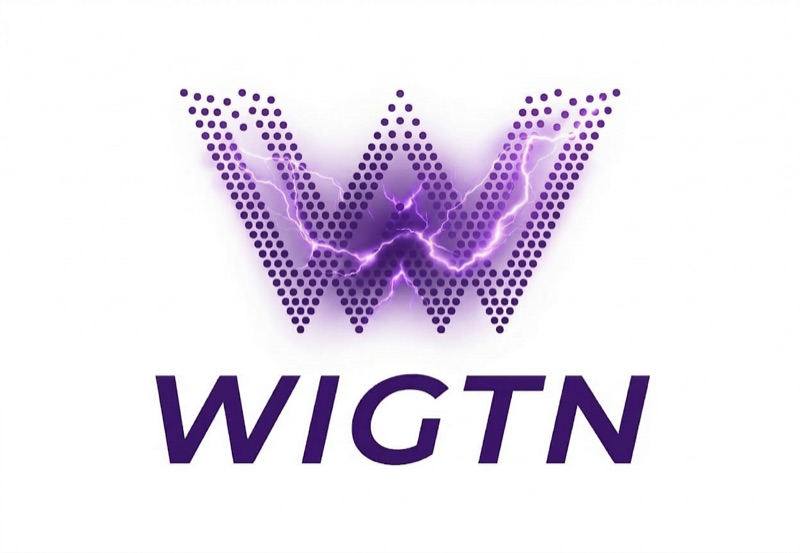

  

<h3 align="center">We prove ourselves by what we build, not how long we've built.</h3>

  
  
  

  
  
  

---

## Who We Are

**WIGTN** (와 이게 되네 — *"Wow, this actually works!"*) is a 5-person AI-native crew based in Korea. We build practical, domain-specialized AI tools and ship them as open-source — from fine-tuned VLMs to real-time voice translation systems.

**Build with TRAE Seoul (ByteDance) — Grand Prize Winner.** Our project [Wigent](#wigent--agent-arena) won the Grand Prize at ByteDance's *Build with TRAE @Seoul* hackathon on the theme of AI Agent development.

## Projects

### TimeLens — AI Cultural Heritage Companion
> **Google Gemini Live Agent Challenge** &middot; Status: **Live**

AI-powered museum guide. Point your camera at an artifact and get real-time AI explanations with historical context and restoration visualizations. Built with Gemini Live API and Google ADK.

---

### Wigent — Agent Arena
> **Build with TRAE Seoul Grand Prize** &middot; Status: **Released**

Multi-agent debate platform. Throw in a topic and watch a PM agent + auto-spawned expert agents discuss, argue, retire, and spawn new specialists in a Slack-style chat UI — then auto-generate a landing page from the conclusions. Built in 3.5 hours by 3 members using parallel Claude Code development.

---

### WIGVU — YouTube Subtitle Extraction & Translation
> Status: **Active**

Extract subtitles from YouTube captions or via WhisperX STT, auto-translate English to Korean with GPT-4o-mini, and synchronize in real-time. Built entirely with WIGTN Coding plugin — full microservices architecture (Web, API, AI) through AI-assisted development.

---

### WIGSS — Visual Code Refactoring with AI
> Status: **Active** &middot; Published on npm

> *"Drag your UI components — the source code rewrites itself."*

Point WIGSS at your running dev server, visually drag and rearrange UI components in the browser, and watch the source code rewrite itself with an always-on AI agent.

---

### WIGEX — Travel Expense Tracker
> Status: **Active**

Mobile app for recording and managing overseas travel expenses. Receipt OCR powered by our own WigtnOCR model with real-time currency conversion and offline support. Monorepo + Microservices Architecture (Expo mobile, NestJS backend, Next.js admin).

---

### WIGTN Coding — Claude Code Plugin Ecosystem
> Status: **Active** &middot; v2.0.0

From idea to deploy, zero friction. A single, unified Claude Code plugin with **12 agents**, **3 skills**, and **17 design styles** — all working together with team-based parallel execution for 3-5x speedup.

---

## Research

### WIGVO — Real-Time Voice Translation for Phone Calls
> **ACL 2026 System Demonstrations** (submitted) &middot; Status: **Live**

Real-time bidirectional voice translation over actual PSTN phone lines. No apps needed on the recipient's end — just call. Dual-Session Echo Gating architecture. 0 echo-loop incidents across 148 production calls. 430+ passing tests. Production-deployed on Google Cloud Run.

---

### WigtnOCR-v1 — Korean Document Parsing Model
> **EMNLP 2026 Industry Track** (targeting) &middot; Status: **Released**

Pseudo-Label Distillation for Structure-Preserving Document Parsing. Distills Qwen3-VL-30B into a 2B student via quality-filtered pseudo-labeling and LoRA fine-tuning. Proves: better parsing leads to better chunks leads to better retrieval on Korean government documents.

| Benchmark | Score | Rank |
|-----------|-------|------|
| OmniDocBench Table TEDS | 0.649 | **#1** |
| KoGovDoc-Bench Retrieval Hit@1 | 0.739 | **#1** (among 6 parsers) |

---

## Team

| Name | Role | GitHub |
|------|------|--------|
| Hyeongseob Kim | Founder & Crew Lead | [@Hyeongseob91](https://github.com/Hyeongseob91) |
| Jinmo Kim | Solution Architect | [@moriroKim](https://github.com/moriroKim) |
| Hyeonsang Kim | AI Product Engineer | [@HyeonsangKim](https://github.com/HyeonsangKim) |
| Sangwoo Son | AI Engineer | [@wigtn](https://github.com/wigtn) |
| Hyunwoo Cho | AI Product Engineer | [@starz-woo](https://github.com/starz-woo) |

## License

&copy; 2025-2026 WIGTN. All rights reserved. Individual projects are licensed as indicated in their respective repositories.
